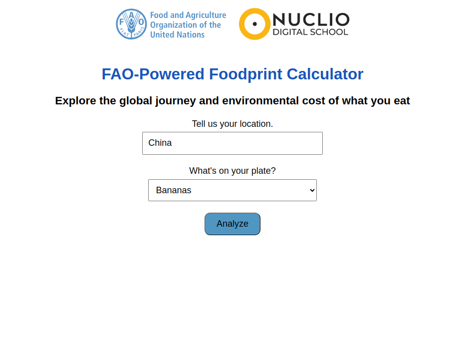
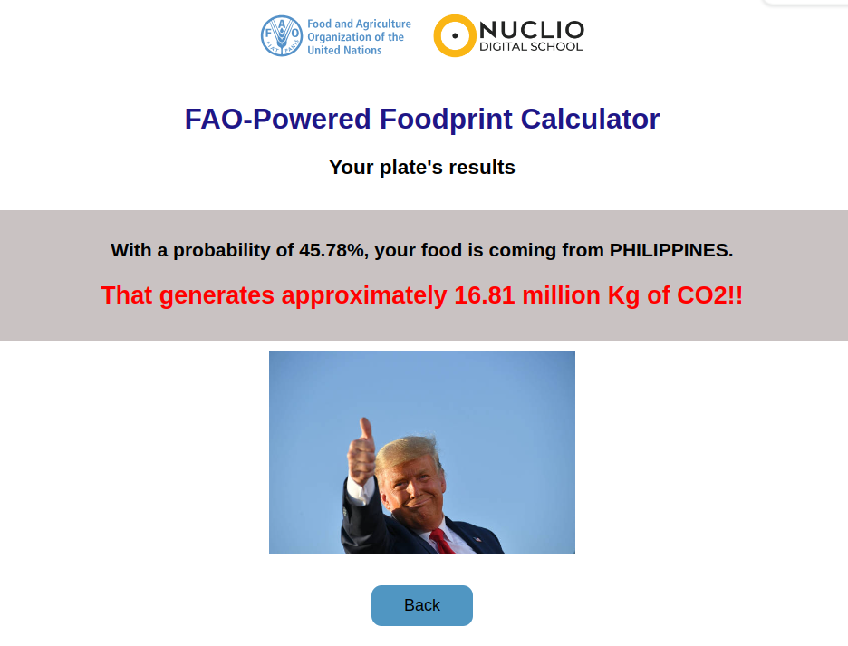
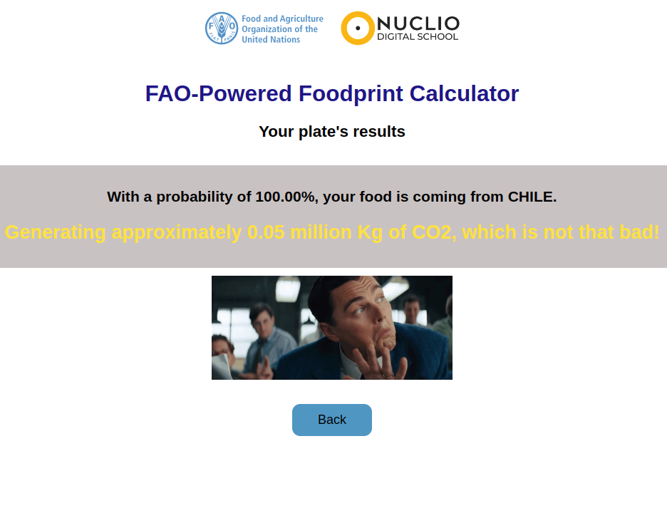
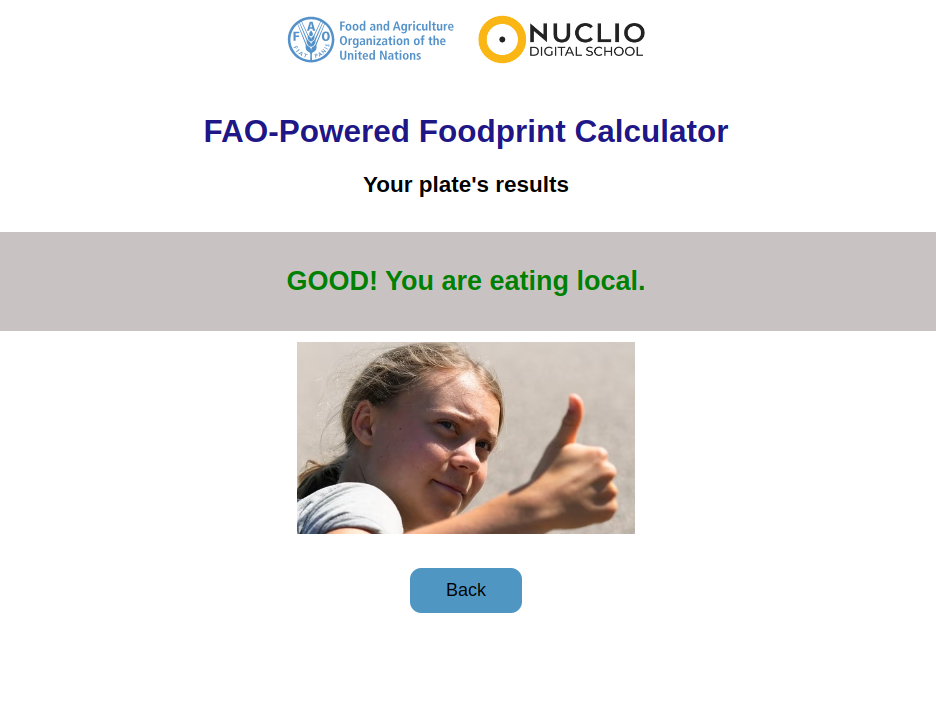

      


# Dockerized Flask Web App for Food Origin and Environmental Impact Estimation

This repository contains the code for a Dockerized Flask web application that predicts the origin and environmental impact of your food based on data analyzed from the FAO (Food and Agriculture Organization of the United Nations) in another repository called [fao_carbon_footprint](https://github.com/ezemriv/fao_carbon_footprint).

<a href="https://fao-co2-food-travel-emissions.onrender.com/" target="_blank">
    
</a>

## Overview

The web app takes user input on two parameters: 
1. **Location** (your country)
2. **Food item** (selected from a list of FAO food items)

Based on this input, the app returns:
- The probability that your food comes from a specific country.
- The estimated CO2 emissions (in million kg) generated during its transportation.

## Data Processing

- **find_top_sources Function**: This function filters the FAO data for the selected country and food item, calculates the total weight of imported food from each source country, and computes the probability of each source country contributing to the user's food supply.
- **Distance and CO2 Evaluation**: If the food is imported from countries with significant distances (greater than 2000 km), the function evaluates the environmental impact using the CO2 emission factor (kgCO2eq_tkm).

## Frontend

- The app's frontend is a simple Flask template rendered with `home.html` and `result.html`, displaying:
  - The probability of the food's origin.
  - The CO2 emissions generated by its transportation.
  - Visual feedback using images based on the environmental impact.

## Technologies Used

- **Docker**: To containerize the application for easy deployment.
- **Flask**: Web framework for creating the web application.
- **Pandas**: For data manipulation and reading the FAO dataset.
- **HTML/CSS**: Basic web frontend rendering.

## Running the App

To run the app locally with Docker:

1. Build the Docker image:

   ```bash
   docker build -t food-origin-app .
   docker run -p 5000:5000 food-origin-app

## Previews

<table>
  <tr>
    <td></td>
    <td></td>
  </tr>
  <tr>
    <td></td>
    <td></td>
  </tr>
</table>
